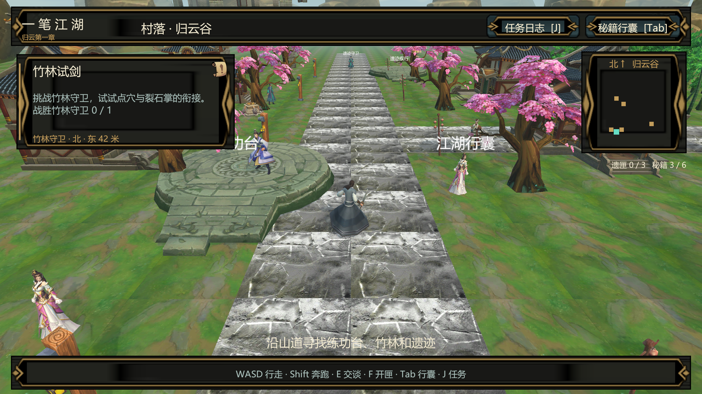
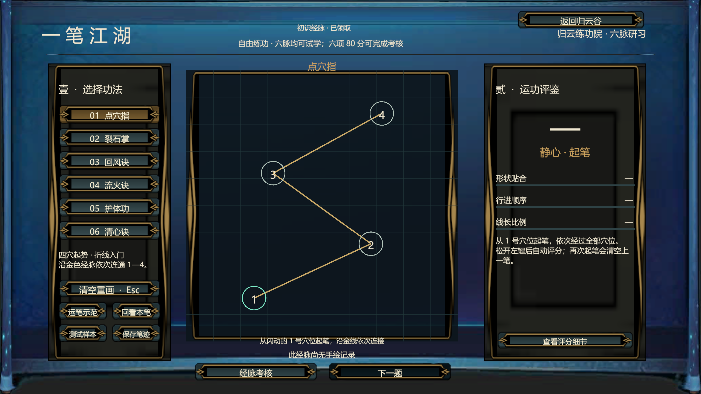

# 一笔江湖

一款使用 **Unity 和 C#** 开发的 **3D 武侠回合制游戏 Demo**，包含场景探索、任务成长、技能构筑和双人 1v1 对战。

核心玩法是**用鼠标连穴施法**：选择招式后，按顺序画出穴位路线，系统根据轨迹形状、连穴顺序和路径长度评分，再将评分用于技能结算。玩家可以在练功场熟悉路线，也可以进入擂台进行回合制战斗。

**[下载 Windows 试玩](https://github.com/lovernook/yibi-jianghu/releases/latest/download/YibiJianghu-Windows-x64.zip)** · **[下载完整 Unity 工程](https://github.com/lovernook/yibi-jianghu/archive/refs/heads/main.zip)**

## 游戏内容

- **江湖探索**：在 3D 场景中移动、与 NPC 交谈、开启宝匣，完成任务并获取奖励；支持任务手札、行囊和本地存档。
- **连穴练功**：六条穴位路线，提供轨迹示范、绘制回放和分项评分，帮助玩家熟悉不同招式。
- **回合战斗**：选择技能搭配，结合画线评分、状态效果与回合顺序进行战斗。
- **双人论武**：独立服务端管理房间和战斗状态，两个客户端可创建、加入房间，完成对局、再战和更换构筑。





## 技术实现

| 技术 | 在项目中的用途 |
| --- | --- |
| Unity 2022 LTS、C#、URP | 3D 场景、角色控制、游戏逻辑与画面渲染 |
| GameFramework | 使用 Procedure、Fsm、Event 模块组织应用流程、状态切换和事件通知 |
| UGUI、Animator、Prefab | 菜单、战斗 HUD、任务与行囊界面，以及角色动作表现；场景与界面可在编辑器直接修改 |
| ScriptableObject | 配置技能、任务、奖励与表现资源，便于增删和调整内容 |
| TCP Socket、独立 .NET 服务端 | 房间通信、服务端战斗判定、请求去重、状态版本和断线恢复 |
| 共享 C# 规则、JSON | 客户端与服务端复用战斗规则，进行协议序列化及数据存取 |
| Unity Test Framework | 评分、战斗、任务和场景资源的自动化测试 |

画线评分与战斗规则放在独立的 C# 模块中，界面和动画根据结果更新。服务端负责联机对局的状态判定，客户端负责输入、展示和交互，避免将战斗结果绑定到动画播放时机。

## 运行试玩

下载并**完整解压** Windows 试玩包，双击 `YibiJianghu.exe`。无需安装 Unity 或 .NET；请保留旁边的文件夹和 DLL。

| 操作 | 按键 |
| --- | --- |
| 移动 / 奔跑 | WASD / Shift |
| 交谈 / 开启宝匣 | E / F |
| 行囊 / 任务手札 | Tab / J |
| 调整镜头距离 | 鼠标滚轮 |
| 连穴施法 | 选择技能 → 按住左键依次连穴 → 松开查看评分 → 确认 |

### 同机双人对战

1. 运行试玩包中的 `Start-Local-1v1.cmd`，启动本地服务端和两个客户端。
2. 两端进入“双人论武”，使用地址 `127.0.0.1`、端口 `7777`。
3. 一端创建房间，另一端输入房号加入，随后开始对战。
4. 试玩结束后关闭两个客户端和服务端窗口。已有服务端运行时不要重复启动。

仓库不提供公网服务器。目前联机测试使用同一台电脑上的两个独立客户端，跨设备连接需另行配置地址并测试。

## 打开工程

使用 **Unity 2022.3.62f3c1**，在 Unity Hub 中打开仓库内的 `一笔江湖/` 目录。首次打开需要联网获取 Unity 官方包并导入素材，完成后打开：

```text
Assets/_Game/Scenes/MainMenu.unity
```

工程包含源代码、场景、Prefab、配置和使用到的美术资源，不包含 Library 缓存和历史构建。无需安装 Unity MCP 插件。

### 代码位置

```text
一笔江湖/Assets/_Game/
  App/           应用流程与 GameFramework 接入
  Rules/         连穴评分与战斗规则
  Network/       客户端网络连接
  NetworkShared/ 共享协议与消息帧
  Progression/   任务、奖励与存档
  Battle/        战斗流程与表现
  UI/、World/    界面和场景交互
Server/          独立对战服务端
Tests/           规则与网络测试
```

使用 .NET SDK **10.0.401** 可从仓库根目录启动源码服务端：

```powershell
dotnet run --project Server/GameServer --configuration Release -- 7777
```

独立规则测试：

```powershell
dotnet run --project Tests/RulesCheck --configuration Release
```

Unity 测试可在 Test Runner 中运行。当前下载工程已通过 132 项 EditMode 测试，独立规则检查通过 45 项；试玩包完成了页面切换及双客户端五局对战测试，包括延迟、响应恢复和再战。

## 资源说明

GameFramework 保留原 MIT 许可证。美术资源来自购买素材，权利归原作者；本仓库不授予素材单独提取、再分发或商用的许可。
