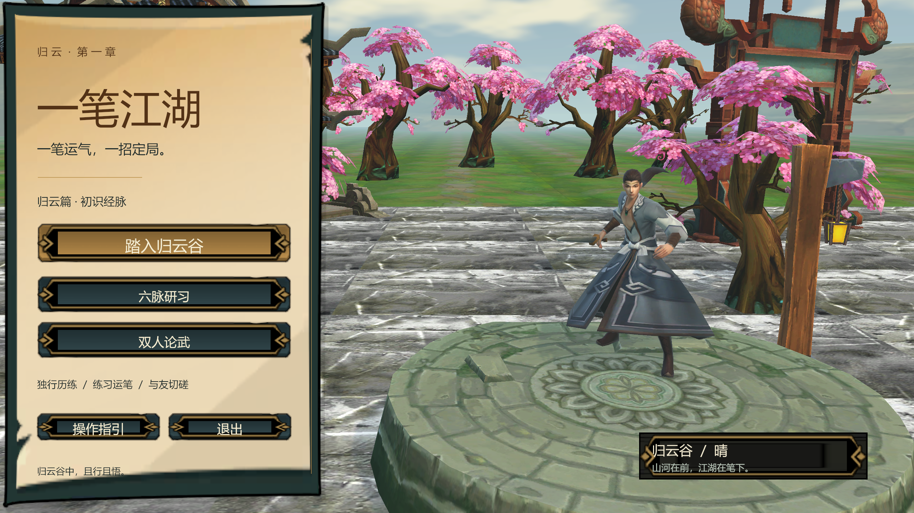
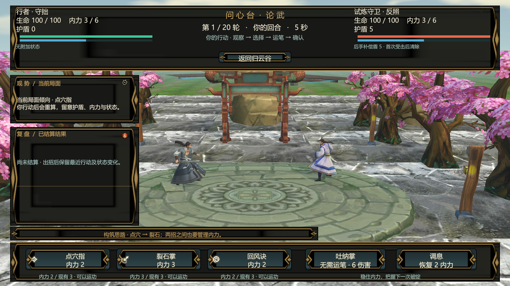

# 一笔江湖

Unity 3D 武侠探索与鼠标连穴施法作品原型，结合回合制技能构筑、任务成长和独立服务端 1v1。使用 Unity 2022.3.62f3c1、C#、UGUI 和 GameFramework 的 Procedure / Fsm / Event 模块。

> 本仓库提供完整精简 Unity 工程。无需 Unity 的 Windows 试玩包见下方下载。实现与测试有 AI 辅助；当前为作品原型，尚未完成发行级验收。

## 下载试玩

**[下载 Windows 64 位试玩包](https://github.com/lovernook/yibi-jianghu/releases/latest/download/YibiJianghu-Windows-x64.zip)** · [版本说明与全部下载](https://github.com/lovernook/yibi-jianghu/releases/latest)

解压后运行 `YibiJianghu.exe`，请保留所有相邻文件夹。无需安装 Unity 或 .NET。单人探索与练功直接进入；同机双人联机可运行 `Start-Local-1v1.cmd`，按说明在两端创建/加入房间。

源码：点击 **Code → Download ZIP** 或 `git clone`，用 Unity Hub 打开 `一笔江湖/`，版本 **2022.3.62f3c1**。首次打开需联网下载 Unity 官方包并导入资源；随后打开 `Assets/_Game/Scenes/MainMenu.unity`。仓库保留 `.meta`、场景、Prefab、配置及全部必要依赖，排除 Library、Temp、历史构建和大批未使用素材。

## 实际画面






## 已实现

- 3D 探索：行走、奔跑、交谈、宝匣、任务手札、行囊与存档；任务和奖励通过 ScriptableObject 配置，奖励领取去重。
- 连穴施法：鼠标采样、路线匹配、穴位顺序及轨迹评分，提供评分解释、示范与回放；六条练功路线接入技能效果。
- 回合战斗：共享纯 C# 规则、状态归约、技能构筑与动作反馈，逻辑判定与动画表现分离。
- 联机：独立 TCP 服务端、多房间 1v1、服务端判定、请求去重、状态版本、断线恢复、再战与换构筑。
- 编辑器交付：原工程中的 8 个构建场景、固定 UI、角色及 Prefab 已保存，可在 Hierarchy / Inspector 编辑。角色动作完整度及后续计划见验证记录。

## 代码导览

| 目录 | 内容 |
| --- | --- |
| `一笔江湖/Assets/_Game/Rules` | 可独立测试的连穴评分、战斗规则 |
| `一笔江湖/Assets/_Game/NetworkShared` | 客户端与服务端共享协议及帧封装 |
| `一笔江湖/Assets/_Game/App` | GameFramework 应用流程 |
| `一笔江湖/Assets/_Game/Progression` | 任务、奖励和存档 |
| `一笔江湖/Assets/_Game/Battle`、`UI`、`World` | 战斗表现、界面和场景交互 |
| `Server`、`Tests` | 独立服务端及纯 C# 测试入口 |
| `一笔江湖/Assets/ThirdParty/GameFramework` | GameFramework 源码及原 MIT 许可证 |

## 服务端与测试

安装 .NET SDK **10.0.401** 后，在仓库根目录运行：

```powershell
dotnet run --project Tests/RulesCheck --configuration Release
dotnet run --project Server/GameServer --configuration Release -- 7777
```

保持服务端运行，在另一个终端执行协议检查（测试会创建本地房间）：

```powershell
dotnet run --project Tests/NetworkCheck --configuration Release
dotnet run --project Tests/NetworkLifecycle --configuration Release
```

Unity 专项测试可通过 Test Runner 在导入完成的工程中执行。历史自动化脚本的构建路径需按本机位置调整。这里没有部署公网服务。

## 验证与边界

阶段 D 原工程已通过 132 项 EditMode、50 项 PlayMode；最终练功配色修改后相关 16 项 PlayMode 再次通过。Windows 最终构建记录为 0 错误、0 警告。已运行应用导航、任务、完整战斗及同机两个独立客户端五局回归，覆盖延迟、丢响应恢复、再战和换构筑。

这些结果属于阶段 D 原工程；不等同于两台物理电脑或公网验证。当前 NPC 部分只有待机，胜利动作暂用收势；完整声音特效、前台性能、多分辨率和真人手感验收仍待完善。不以历史后台运行数据宣称稳定 60 FPS。

- [验证记录](Docs/阶段D验证记录.md)
- [使用与讲解](Docs/阶段D使用与讲解.md)
- [核心调用链与面试讲解](Docs/核心模块与面试讲解.md)
- [后续计划](Docs/成熟作品重构方案.md)

## 素材与许可

工程包含作者提供的购买素材中实际引用的部分；仓库公开不授予这些素材的再分发或商用权。项目现存记录未附完整素材再分发许可，权利仍归原作者；请勿将其提取为素材包。第三方代码遵循各自保留的许可证；本项目原创代码未另行授予开源许可。
